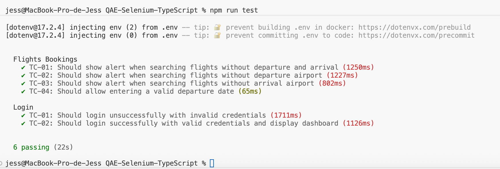

# Test Implementation Strategy

**Key architectural decisions:**

- **Shared WebDriver instance:** A single Chrome WebDriver instance is initialized in the fixture's `before` hook and reused across tests within the same suite, then closed in the `after` hook. This improves test execution speed while maintaining isolation between test suites.
- **Centralized page object initialization:** All page objects are instantiated in `pages-fixtures.ts` and exported for use in test specs, ensuring consistent driver usage across all pages.
- **Environment-based configuration:** Sensitive data (credentials) are stored in `.env` files and loaded via `dotenv`, keeping secrets out of version control.

### Coverage Approach

Tests are organized by **feature modules** with clear naming conventions:

- **Test IDs:** Each test case follows the format `TC-XX` for traceability
- **Descriptive test names:** Test descriptions clearly state the expected behavior (e.g., "Should show alert when searching flights without departure and arrival")
- **Modular test suites:** Each spec file focuses on a specific feature area (login, flight bookings, etc.)

**Coverage strategy:**

- Positive and negative test scenarios
- Boundary value testing (e.g., empty fields, invalid inputs)
- User workflow validation (e.g., login > navigation > feature interaction)

### Design Patterns

- **Page Object Model (POM):** UI interactions are encapsulated in page classes, separating test logic from page-specific implementation details
- **DRY principle:** Reusable helper functions for test data generation and common operations
- **Fixture pattern:** Centralized setup/teardown logic in `pages-fixtures.ts` to avoid code duplication across test files
- **Clear naming conventions:** Test IDs (TC-XXX) for traceability and descriptive method names for readability

---

## Tools & Libraries

| Tool                | Purpose                                    |
| ------------------- | ------------------------------------------ |
| Selenium WebDriver  | Browser automation and UI interaction      |
| TypeScript          | Type-safe test development                 |
| Mocha               | Test framework and test runner             |
| Chai                | Assertion library                          |
| Faker.js            | Generate dynamic test data (airports, etc) |
| Luxon               | Date/time handling and formatting          |
| dotenv              | Environment variable management            |
| Prettier            | Code formatting                            |


## TypeScript Configuration

Key compiler options in `tsconfig.json`:

- **Target:** ES2022 for modern JavaScript features
- **Module:** CommonJS for Node.js compatibility with Mocha
- **Strict mode:** Enabled for maximum type safety
- **Output directory:** `dist/` for compiled JavaScript files
- **Type checking:** `forceConsistentCasingInFileNames`, `skipLibCheck` for better developer experience

---

## Code Quality

After the implementation of tests and script creation, the commands to format and analyze the code must be executed using Prettier. This was added in the scripts of the `package.json` file:

```json
{
  "scripts": {
    "format": "npx prettier . --write",
    "build": "tsc -p tsconfig.json",
    "test": "npm run build && npx mocha dist/tests/specs/*.spec.js --timeout 120000",
    "login": "npm run build && npx mocha dist/tests/specs/login.spec.js --timeout 120000",
    "flights-bookings": "npm run build && npx mocha dist/tests/specs/flights-bookings.spec.js --timeout 120000"
  }
}
```

### Code Quality Standards

- **Prettier configuration:** Default Prettier rules for consistent code style
- **TypeScript strict mode:** Catches potential bugs at compile time
- **Naming conventions:** 
**camelCase** is used throughout the project for:
  - Variables: `emailAddress`, `departureInfo`, `flightBookingPage`
  - Functions and Methods: `getDriver()`, `quitDriver()`, `goToLoginPage()`, `insertCredentials()`
  - Test data objects: `departureInfo`, `testData`
- **Consistent file naming:**
  - Page classes: `LoginPage`, `DashboardPage` (PascalCase for class names)
  - Test files: `*.spec.ts`
  - Utility files: `test-data.ts`, `base-url.ts` (kebab-case for file names)

---

### Available Test Scripts

```bash
npm test                    # Run all tests
npm run login               # Run login tests only
npm run flights-bookings    # Run flight booking tests only
```

**Test execution results**




### Driver Management

- **Lazy initialization:** Driver is created only when first needed via `getDriver()`
- **Singleton pattern:** Only one driver instance exists per test suite
- **Proper cleanup:** Driver is quit in `afterEach` hook to prevent resource leaks
- **Browser:** Chrome is used by default (configurable in `pages-fixtures.ts`)

---

## Future Improvements

Some future improvements for the project:

1. **Add ESLint configuration** to enforce JS/TS best practices and catch potential bugs;
2. **Implement test reporting** using Mocha reporters (e.g., `mochawesome` for HTML reports);
3. **Add screenshot capture** on test failures for easier debugging;
4. **Support multiple browsers** via configuration (Firefox, Edge, etc);
5. **Implement parallel test execution** to reduce overall test runtime;
6. **Add CI/CD integration** (Gitlab CI, Jenkins, Circle CI, etc) for automated test runs;
7. **Create reusable assertion helpers** to reduce code duplication in test specs;
8. **Implement test data cleanup** to maintain test independence and prevent side effects;

---

**Author:** Jessica Silva
